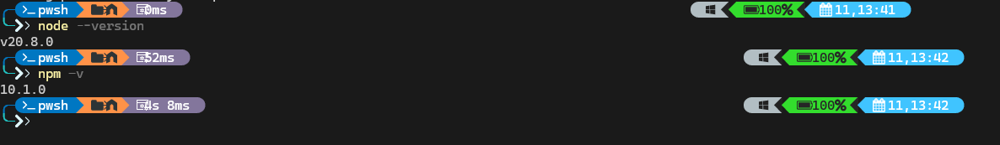

  <h3>Cypress Cucumber Login</h3>

 
 

  
Table of contents

  <ol>
    <li>
      <a href="#description">Description</a>
    </li>
    <li>
      <a href="#getting-started">Getting Started</a>
    </li>
    <li>
      <a href="#how-to-use">How to use</a>
    </li>
    <li>
      <a href="#folder-structure">Folder Structure</a>
    </li>
  </ol>

<h2 id="description"> ≼◥◣ܫ◢◤≽ Description ≼◥◣ܫ◢◤≽</h2>

This project will allow you to have a starting point to create login end-to-end tests using cypress, cucumber.

<a href="#top">🔝</a>

<h2 id="getting-started">✎▁▁▁▁Getting Started▁▁▁▁</h2>

Technologies used and that are necessary prior to installation:

- [Node](https://nodejs.org/) <small>JavaScript runtime (I recommend using [nvm](https://github.com/nvm-sh/nvm) to manage multiple versions of node).</small>
- [Eslint](https://eslint.org/) <small>JavaScript linter.</small>
- [Cypress](https://www.cypress.io/) <small>End-to-End testing runner.</small>
- [Cucumber](https://cucumber.io) <small>Cucumber is a tool that supports Behaviour-Driven Development (BDD).</small>
- [Gherkin](https://cucumber.io/docs/gherkin/reference/) <small>The syntax that Cucumber understands to run the tests.</small>

  Used versions in this project:
 

    Install all dependencies from package.json

<a href="#top">🔝</a>

<h2 id="how-to-use">✎▁▁▁▁How to use▁▁▁▁</h2>

| Scripts      | Description                                                                                             |
|--------------|---------------------------------------------------------------------------------------------------------|
| cy:dev       | Will open the Cypress interface to run the tests agains the dev env. In the project this is amazon.de   |
| cy:com       | Will open the Cypress interface to run the tests agains the prod env. In the project this is amazon.com |

<a href="#top">🔝</a>

<h2 id="folder-structure">✎▁▁▁▁Folder structure▁▁▁▁</h2>

The following folder structure shows only the most important folders.

    .
    ├── cypress/
    │   ├── downloads/
    │   ├── e2e/
    │   │   ├── features/                         # Features folder.
    │   │   │   ├── {feature}.feature             # Feature 1 file.
    │   │   │   │
    │   │   │   └── {feature}.feature             # Feature 2 file. Same like feature file 1, but some scenarios are combined.
    │   │   │   │
    │   │   └── step_definitions/                # Step definitions folder.
    │   │   │   └──{step_definition}.js          # Step definition file
    │   ├── support/
    │   │   ├── commands.js
    │   │   └── e2e.js
    │   ├── fixtures/
    │   ├── screenshots/                          # Folder with the screenshots of the failed tests
    │   ├── support/
    │   └── videos/                               # Folder with the videos of the failed tests. Not enabled in this project
    ├── .cypress-cucumber-preprocessorrc.json     # Configuration file for the cucumber preprocessor.
    ├── cypress.config.js                         # Main Configuration file for the Cypress interface.
    ├── dev.config.js                             # Dev Configuration file for the report generator.
    ├── prod.config.js                            # Prod Configuration file for the report generator.
    └── ...

<a href="#top">🔝</a>

## License

✎▁▁▁▁TSVETAN TOSHEV▁▁▁▁
